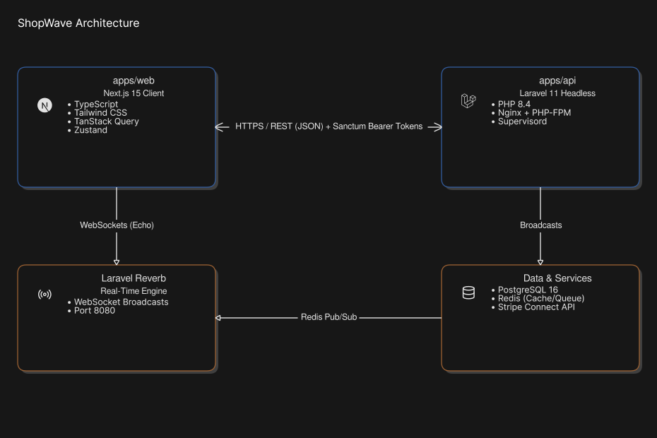

# 🛍️ ShopWave — Multi-Vendor E-Commerce Marketplace

> A production-grade, multi-vendor marketplace where independent vendors sell through their own storefronts, customers check out a single cart spanning multiple sellers, and payments are split automatically between vendors and the platform — split payments, real-time notifications, and a full admin moderation/dispute workflow, not just a CRUD storefront.


<!-- Add 2–3 screenshots or a short GIF here (storefront, vendor dashboard, admin panel) — this is the single highest-impact thing you can add to this file. -->

---

## 📑 Contents

[Why This Project](#-why-this-project) · [Features](#-features) · [Engineering Highlights](#-engineering-highlights) · [Architecture](#-architecture) · [Tech Stack](#-tech-stack) · [Monorepo Layout](#-monorepo-layout) · [Quick Start (Docker)](#-quick-start-docker) · [Testing Payments (Stripe)](#-testing-payments-stripe) · [Testing & API Contract](#-testing--api-contract) · [Roadmap](#-roadmap) · [Known Limitations](#-known-limitations) · [About](#-about)

---

## 🎯 Why This Project

Most portfolio e-commerce apps stop at "add to cart, checkout, done." ShopWave is built to show the parts that separate a demo from production-shaped engineering:

- **Real marketplace payments** — Stripe Connect with split transfers, webhook-driven order creation, and a refund flow that correctly reverses an already-paid-out vendor Transfer (Stripe doesn't do this for you).
- **A decoupled, headless architecture** — a Laravel API and a Next.js app that know nothing about each other's internals, talking over a versioned, contract-tested REST API.
- **Performance-conscious design** — Redis-backed carts instead of a DB write on every browse, and observer-based rating aggregation instead of `AVG()` at read time.
- **Real-time systems** — Laravel Reverb driving a hybrid persisted-and-live notification system that survives a recipient being offline.
- **Operational maturity** — a phased build (each feature ships with a test and a Postman entry before the frontend touches it), a role-gated admin panel, and a fully containerized, one-command deployment.

## ✨ Features

| Area | What it does |
|---|---|
| **Vendor onboarding** | Any account can become a vendor via Stripe Connect OAuth; selling is gated on identity verification, kept in sync by a webhook. |
| **Catalog & search** | Nested categories, filterable/sortable product search, Redis-cached featured products and category tree. |
| **Cart** | Redis Hash cart (`HINCRBY`-atomic), TTL expiry, guest → user merge on login, live price/stock re-hydration on every read. |
| **Vendor coupons** | Percentage/fixed discounts, scoped per vendor — never the whole multi-vendor order. |
| **Split checkout** | One Stripe PaymentIntent per order, grouped and transferred per vendor on webhook confirmation. |
| **Vendor dashboard** | Revenue/order stats, 30-day chart, low-stock alerts, drag-and-drop product images, order tracking. |
| **Reviews & ratings** | One review per delivered order item, 48-hour edit window, vendor replies, precomputed aggregate ratings. |
| **Real-time notifications** | Persisted + live (Reverb) — new orders, low stock, new reviews, order status, admin actions — with a toast + bell UI. |
| **Admin panel** | Platform GMV/revenue dashboard with charts, vendor suspension, product moderation, and dispute resolution (refund with Transfer reversal, or manual payout release). |

## 🧠 Engineering Highlights

The parts worth asking me about in an interview:

- **Split payments via "Separate Charges and Transfers," not destination charges** — the only Stripe Connect pattern that lets one checkout fan out across multiple vendors. Refunding an already-paid-out order requires an *explicit, separate* Transfer reversal first — Stripe never does this automatically, and missing it would leave a vendor holding funds for a refunded order.
- **Cart correctness without locking** — the cart is a Redis Hash, not a JSON blob, so add-to-cart uses `HINCRBY` for atomic, race-free increments with zero Lua scripting or manual locking.
- **Notifications that survive being offline** — built on Laravel's Notification classes (`database` + `broadcast` channels together) rather than events-only broadcasting, so a vendor who wasn't connected when an order fired still sees it. The notification's own DB id threads through both delivery paths so the frontend can de-duplicate.
- **A real authorization bug, found and fixed** — `spatie/laravel-permission`'s role checks are guard-aware and resolve against `config('auth.defaults.guard')`. This API authenticates purely via `sanctum`, but that config still defaulted to Laravel's `web` guard — silently breaking every admin permission check, including the middleware protecting real routes. One-line fix, outsized blast radius, exactly the kind of thing that's easy to miss and expensive to leave.
- **Same bug, different layer, found in Docker** — the containerized API worked fine from `artisan tinker` but failed every real HTTP request with the wrong DB credentials. Root cause: php-fpm's default `clear_env=yes` strips the environment for every worker process, so it silently fell back to a stale on-disk `.env`. Fixed by an explicit `clear_env=no` in the fpm pool — the same class of "config default quietly wins" bug as above, in a completely different part of the stack.
- **One response envelope, everywhere** — every controller returns `{ success, message, data, errors }` via a shared `ApiResponse` helper, so the frontend has exactly one error-handling code path instead of bespoke parsing per endpoint.
- **Caching Eloquent models by value, not by reference** — `Cache::remember()` always gets `->toArray()` first. Caching a model/Collection directly serializes its class shape; if that shape changes during active development, unserializing it back can silently drop relations.

## 🏗️ Architecture


Six Docker services: **postgres**, **redis**, **api** (nginx + php-fpm), **queue** (worker), **reverb** (websockets), **web** (Next.js).

## 💻 Tech Stack

| Layer | Choice |
|---|---|
| Frontend | Next.js 16 (App Router), TypeScript, Tailwind + shadcn/ui, TanStack Query, Zustand, react-hook-form + zod, Recharts, dnd-kit |
| Backend | Laravel 13, PHP 8.4, Sanctum, single-responsibility Action classes, spatie/laravel-permission |
| Data | PostgreSQL 16, Redis (cart, cache, queues) |
| Real-time | Laravel Reverb (WebSockets), Laravel Echo |
| Payments | Stripe Connect — split payments, refunds, Transfer reversals |
| Infra | Docker & Docker Compose, nginx + php-fpm |
| Testing | PHPUnit feature tests (one per endpoint), a full Postman collection |

## 📂 Monorepo Layout

```text
shopwave-monorepo/
├── apps/
│   ├── web/              # Next.js frontend — see apps/web/README.md
│   └── api/              # Laravel API — see apps/api/README.md
├── postman/
│   └── ShopWave.postman_collection.json
├── docker-compose.yml
└── Makefile
```

## 🚀 Quick Start (Docker)

Requires only Docker + Docker Compose.

```bash
git clone https://github.com/GeorgeAntwanHosny/shopwave
cd shopwave-monorepo
cp .env.example .env        # then fill in your own Stripe test keys — see below
make up                      # builds + starts postgres, redis, api, queue, reverb, web
```

| Service | URL |
|---|---|
| Frontend | http://localhost:3000 |
| API | http://localhost:8000 |
| Reverb (WebSocket) | ws://localhost:8080 |

First boot runs migrations + seeders automatically. To try the admin panel, promote yourself once the containers are up:

```bash
docker compose exec api php artisan admin:promote you@example.com
```

Other Makefile commands: `make down`, `make fresh` (wipes all data and rebuilds), `make logs`.

## 💳 Testing Payments (Stripe)

1. Create a free [Stripe account](https://dashboard.stripe.com/register) — no business verification needed for test mode — and grab your **test-mode** keys from the [API keys page](https://dashboard.stripe.com/test/apikeys). Put them in `.env`:
```env
   STRIPE_SECRET=sk_test_...
   NEXT_PUBLIC_STRIPE_PUBLISHABLE_KEY=pk_test_...
```
2. Install the [Stripe CLI](https://docs.stripe.com/stripe-cli) and forward webhooks to the running containers — two listeners, since Connect and payments use separate event streams:
```bash
   # Vendor onboarding (Stripe Connect thin events)
   stripe listen --thin-events 'v2.core.account[requirements].updated' \
     --forward-thin-to http://localhost:8000/api/v1/webhooks/stripe

   # Checkout / payments (classic webhooks)
   stripe listen --forward-to http://localhost:8000/api/v1/webhooks/stripe-payments
```
   Each command prints a `whsec_...` signing secret — copy them into `.env` as `STRIPE_WEBHOOK_SECRET` and `STRIPE_PAYMENT_WEBHOOK_SECRET` respectively, then restart the API container so it picks up the change:
```bash
   docker compose restart api
```
3. At checkout, use [Stripe's test card](https://docs.stripe.com/testing#cards): `4242 4242 4242 4242`, any future expiry date, any 3-digit CVC, any postal code. No real charge occurs.

## 🧪 Testing & API Contract

```bash
docker compose exec api php artisan test --testsuite=Feature
```

Every backend endpoint ships with a PHPUnit feature test and a Postman entry before any frontend work starts on it. Import `postman/ShopWave.postman_collection.json` to exercise the full API manually, or run it headlessly:

```bash
npx newman run postman/ShopWave.postman_collection.json
```

## 🗺️ Roadmap

- [x] Auth & user model · Vendor onboarding · Catalog & search · Redis cart & coupons
- [x] Split payment checkout · Vendor dashboard · Reviews & ratings
- [x] Real-time notifications (Reverb) · Admin panel
- [x] Dockerized deployment — all 6 services running via `docker compose up`
- [ ] Final environment-parity pass (see Known Limitations)

## ⚠️ Known Limitations

Listed on purpose — these are the honest next steps, not gaps I've missed:

- Reverb's `allowed_origins` is currently `['*']`; needs tightening to the real frontend origin before any real deployment.
- No admin audit log — moderation actions notify the affected vendor/customer but aren't recorded as a separate, queryable history.
- No customer-facing "report" flow for products/reviews — flagging is admin-initiated only, by design for this phase.

## 👤 About

Built solo, end-to-end, as a portfolio centerpiece — architecture, backend, frontend, and deployment.

**George Antwan Hosny Ghaly** — [LinkedIn](https://www.linkedin.com/in/georgeantwan/) · [Portfolio](https://georgeantwanhosny.github.io/portfolio/) · georgeantwanhosnyghaly@outlook.com

Feel free to explore the code and open an issue or reach out if you'd like to talk through any part of the implementation.